# Mockito Sample Project

### by Romell Domínguez
[](https://www.romellfudi.com/)

Comenzemos primero configurando nuestro entorno de pruebas.

[](https://github.com/mockito/mockito/)


[](https://jfrog.com/artifactory/)

## Run test cases

Primero verificamos que esten sus pruebas unitarias de la libraría funcionando correctamente:

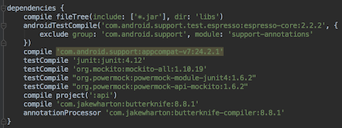

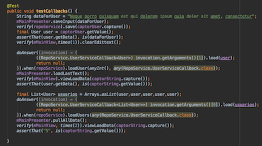

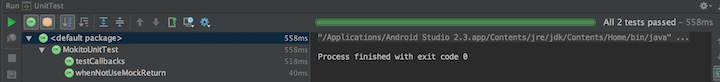

## Upload library/api

En la ruta de nuestro proyecto Android, connectamos los plugins del JFrog Artefactory:

```gradle
classpath "org.jfrog.buildinfo:build-info-extractor-gradle:3.1.1"
```

En el gradle build del módulo api añadimos en el top:

```gradle
apply plugin: 'com.android.library'
apply plugin: 'com.jfrog.artifactory'
apply plugin: 'maven-publish'
```

Definimos varibles constantes:

```gradle
def packageName = 'fudi.freddy.api'
def libraryVersion = '1.0.a'
```

Sobreescribimos el task publishing del motor Gradlew:

```gradle
publishing {
    publications {
        aar(MavenPublication) {
            groupId packageName
            version = libraryVersion
            artifactId project.getName()
            // Preparamos la librería *.aar, ojo al usar flavors
            ("$buildDir/outputs/aar/${project.getName()}-release.aar")
        }
    }
}
```

Creamos un tesk para empaquetar, se puede cofigurar hasta niveles de flavors:
```gradle
artifactory {
    contextUrl = 'http://localhost:8081/artifactory'
    publish {
        repository {
            // Access keys to repo 
            repoKey = 'libs-release-local'
            username = "admin"
            password = "123qweASD"
        }
        defaults {
            // which artifacts should be published
            publications('aar')
            publishArtifacts = true

            properties = ['qa.level': 'basic', 'dev.team': 'core']
            // Publish generated POM files
            publishPom = true
        }
    }
}
```

Desde una terminal arrancamos el repositorio de aplicaciones
* Windows: mediante el executable *"artefactoryService.exe"*
* MAC / Ubuntu: mediante el batch "artefactory.sh" 

Una vez acabado su configuración se lanzará en el puerto 8081 (si desea cambiarlo usar el archivo tomcat/conf/server.xml)

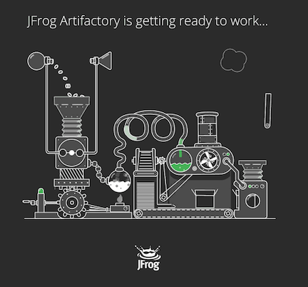

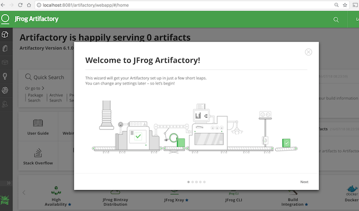

Nos pedirá crear un password

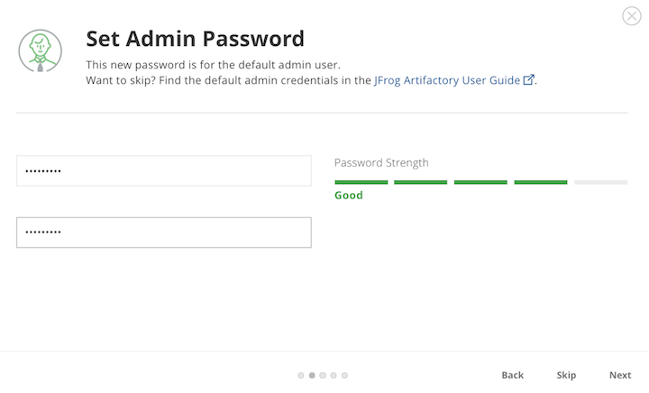

El tipo de arqitectura del repositorio (para nosotros maven)

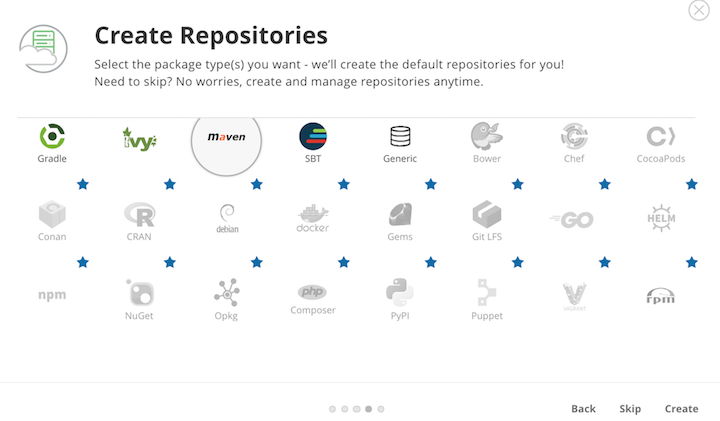

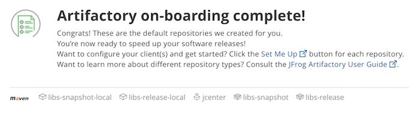

Obtendremos por fin nuestro dashboard del repositorio de apis:

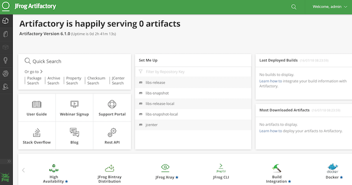

Ahora si enviamos nuestra versión al repositorio de apis mediante los siguientes comandos en el terminal

```sh
# construimos la libraría
./gradlew clean build
# construimos el artefacto con su interfaz, su respectivo archivo pom y enseguida lo publicamos en el repositorio
./gradlew assembleRelease generatePomFileForAarPublication artifactoryPublish 
```

En el panel-menu buscamos la librería

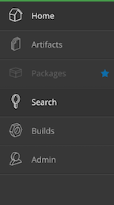

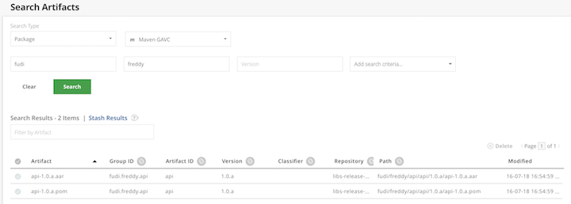

Acá visualizamos el Group ID: fudi.freddy.api, el Artifact ID: api, y la versión: 1.0.a.

## Download library/api

De esta manera puede ser usada en cualquier proyecto dentro de la organización

Como cualquier librería de maven, lo primero es determinar de donde va a obtener las apis.

Dentro de la configuración de la aplicación direccionamos el repositorio maven:

```gradle
repositories {
    maven { url "http://localhost:8081/artifactory/libs-release-local" }
}
```

y cambiamos la dependencia de nuestra librería a la del repositorio:

```sh
//compile project(':api')
compile 'fudi.freddy.api:api:1.0.a'
```
